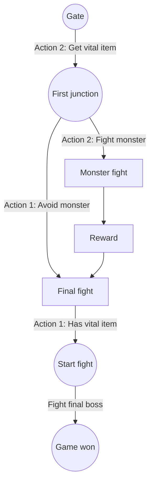

# Simplified example

```mermaid
graph TD;
    0((Gate))-->|Action 2: Get vital item|100;
    100((First junction))-->|Action 1: Avoid monster|200[Final fight];
    100-->|Action 2: Fight monster|110[Monster fight];
    110-->120[Reward]
    120-->200
    200-->|Action 1: Has vital item|210((Start fight));
    210-->|Fight final boss|300((Game won));
```

